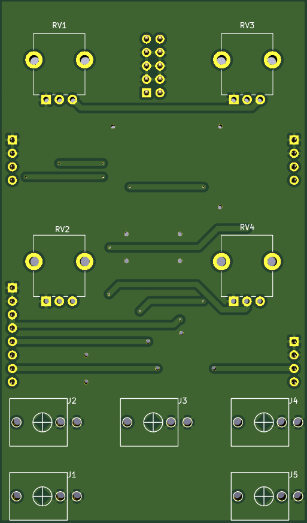
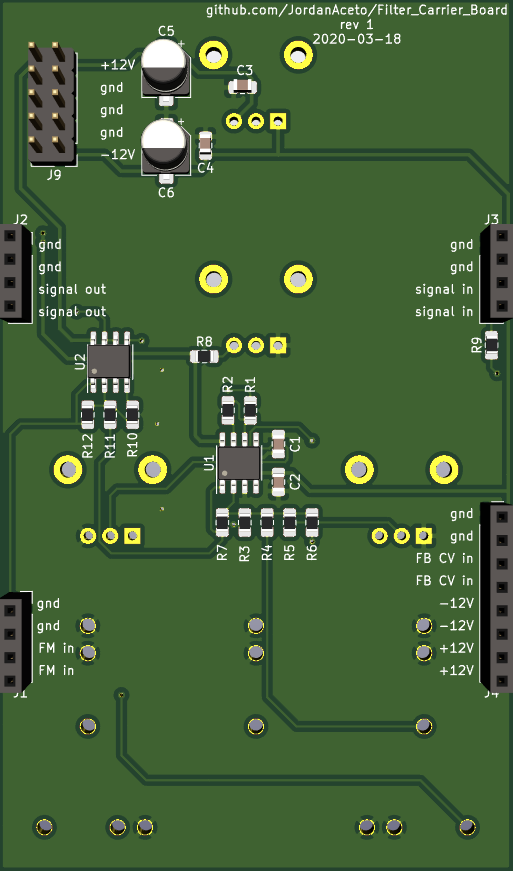

# PCB carrier board for VCF plug-in boards.

# The current pcb rev has a bad problem! The spacing for the plug-in board port is off by 0.1". 

# !!! DO NOT ORDER THE CURRENT PCB LAYOUT !!!

### This PCB is designed to accomodate various filter boards documented elsewhere on my github page. Pots and jacks are mounted on this board, which can be affixed to a Eurorack panel. This way you can have one carrier board/panel, and swap in various VCF designs.

### A 12hp pcb panel is included in this repo as a cheap panel option.

### Since the panal and panel-mount components are typically a large expense in a synth module, this allows you to evaluate and experiment with different filter designs economically.

### Various plug-in boards have already been designed as part of a different project, and this seemed like an easy way to leverage an existing design in order to mess around with a Eurorack setup.

### Here is a link to the repository of the plug-in boards: [LINK](https://github.com/JordanAceto/VCF_plug_in_boards "optical phasor plug-in board")

 

Revision | breadboarded | schematic | pcb layout | built and tested | documentation
---------|--------------|-----------|------------|------------------|---------------
1.1      | &#9745;      | &#9745;   | &#9745;    | &#9744;          | &#9744; 